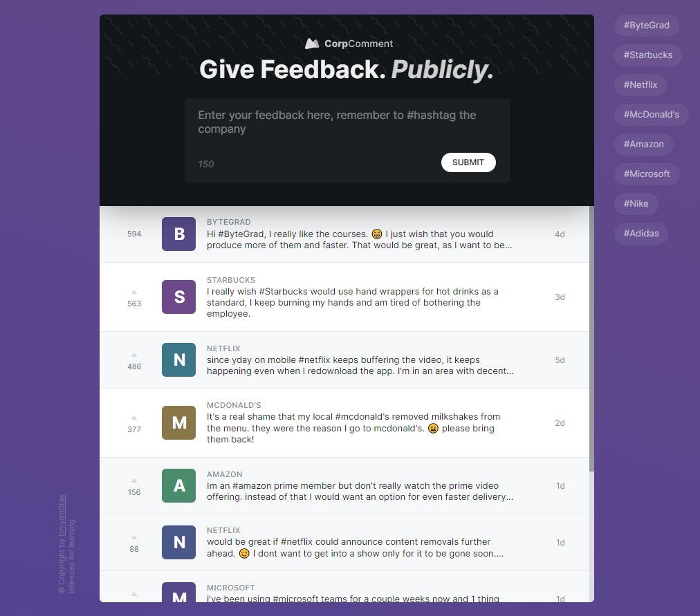

# rmtJob

## Overview

Individual project

CorpComment is an intuitive feedback application tailored for modern service companies. Simplifying communication and collaboration, it offers a seamless platform for users to exchange comments and feedback efficiently.

## Features

- Zustand
- Context API
- Responsive design for optimal viewing on different devices
- Form validation

## Technologies Used

##

> Developed by Dmytro Stas

